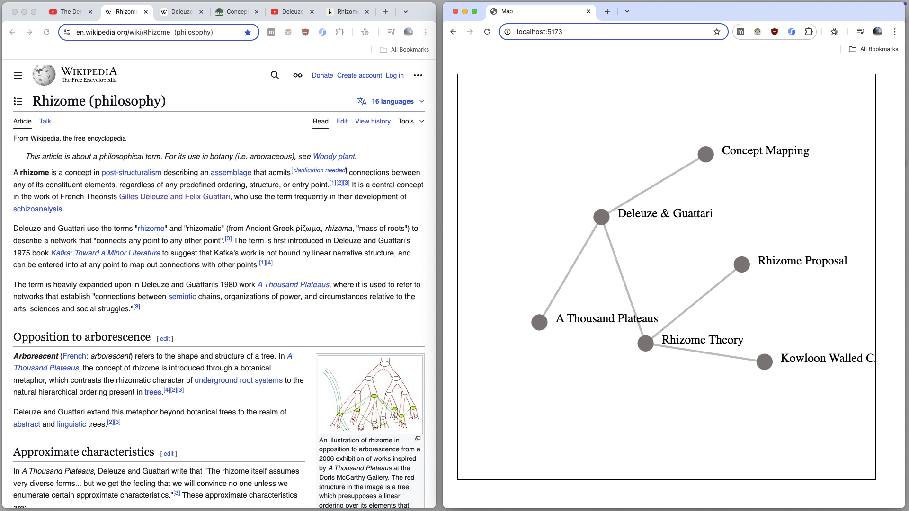

# Browser Mini-Map

(Work in progress)

### What is this?

This is a tool that lets you visualize pages on the web and the relationships between them using network diagrams.

It's a map you can use while browsing.
By plotting important pages (like landmarks), and drawing connections between them, you can actively build your own mental map of the web that you inhabit.

This tool is a map for digital space, and it serves the same purpose as a map of our terrestrial world: an aid for navigating, exploring, and understanding the world.

It's for mapping clusters of information, grouping concepts together, in a way that the linear/hierarchical nature of bookmarks and folders do not allow.

### Features
- List of features
- more features
- so many features

### Why am I making this?
Navigating the internet is hard (and it makes my head hurt).
Our bodies and our minds did not evolve for cyberspace.

The internet is a high-dimensional information space. It is large in scale, and highly complex. Because of this, it is naturally very difficult for us human beings to see the web as real "space",, and not just a giant blob of stuff.

I find that by mapping the space as you go along, you begin to develop a better sense of the internet as a physical space that your nervous system is comfortable moving around in.

Research in cognitive science tells us that our ability to understand things and recall them from memory is related to our motor movements and our sense of place in the world. (Navigating with landmarks, visual queues).
Browsing a world of flat documents on a screen is not a biologically optimal way of taking in information.

Information exists in space, a vast multidimensional space. On our computers, in our file systems and our web browsers, what we see projected onto our two-dimensional screens is a shadow, cast by the forms of information who's
complexity lies in more dimensions than we're able to process at once.
